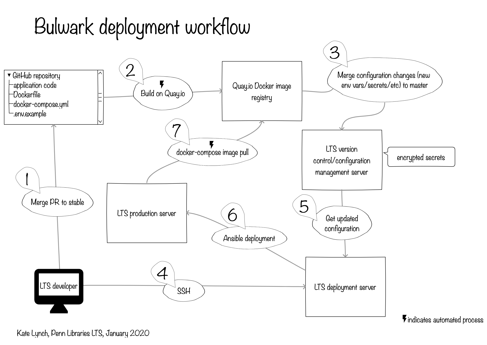

# README for `bulwark`

Bulwark is a Hydra head providing administrative digital asset and metadata generation, management, review, and ingest to a repository with a public facing capability.

## System dependencies

* [Git](https://git-scm.com/) - The application supports robust versioning of content and metadata through the use of git for version control.
* [Git-annex](git-annex.branchable.com) - A git library that allows large binaries to be safely and robustly managed by git without being checked into the git repository.
* [libvips](https://libvips.github.io/libvips/) - Image processing library, used to generate derivatives. 
  Version 8.6+ required.
* [NPM](https://www.npmjs.com/)

## Setting up local development and test environment
We are using [lando](https://docs.lando.dev/basics/) to set up our local development and test environments. We have some custom rake tasks that wrap lando commands and run other necessary tasks.

### Installing system requirements

#### Mac (installing via homebrew)  
```
brew install git-annex
brew install vips
brew cask install lando
```

#### Linux  
See the [lando website](https://docs.lando.dev/basics/installation.html#linux) for installation options
```
sudo apt-get install imagemagick git-annex
```  

### Running Services in Development

#### Starting
  ```
  rake bulwark:start
  rails s
  ```

#### Stopping
  ```
  rake bulwark:stop
  ```

#### Starting Fresh
  ```
  rake bulwark:clean
  rake bulwark:start
  ```

### Adding Data

#### To add administrative user
  ```
  rake bulwark:setup:create_admin
  ```

#### To add digital object and administrative user
  ```
  rake bulwark:setup:create_digital_object
  ```

## Configuration Files
Most of the application-wide configuration is located in `config/settings` and is organized by environment. Global 
configuration settings (ie, settings that are the same for all environments) are located in `config/settings.yml`.

Some gems require custom configuration files to be provided in `config`, so in some cases you might see gem-specific 
config files there, for example:
- `config/solr.yml`
- `config/blacklight.yml`

We provide access to the application-wide configuration via the [config](https://github.com/rubyconfig/config) gem. All 
configuration can be access via the `Settings` object. For example, to retrieve the configured mounted drives:
```ruby
Settings.mounted_drives
```

Additionally, the `Settings` object also provides access to the configuration in `solr.yml`. The Solr url can be 
retrieves by calling:
```ruby
Settings.solr.url
```

#### filesystem.yml
This configuration file specifies semantic information about the filesystem and filesystem behaviors that the application will use for asset lookup.

Run the following command from within your application's root directory:
```bash
cp config/file_extensions.yml.example config/file_extensions.yml
```
An environment block for successfully deploying the application should look like the following:
```yaml
development:
  assets_path: /absolute/path/on/fs
  file_path_label: FILE_PATH
  metadata_path_label: METADATA_PATH
  object_data_path: directory_name
  object_admin_path: directory_name
  object_derivatives_path: directory_name
  object_semantics_location: filename_no_extension
  repository_prefix: PREFIX
  working_dir: /absolute/path/on/fs
  transformed_dir: /absolute/path/on/fs
```

Edit the config file to reflect your local settings for the fields as follows:  
* `assets_path` - The location on the filesystem where the application will maintain preservation-worthy files.
* `file_path_label` - A value used by the application to populate the semantic manifest.  This can be customized, or left FILE_PATH by default.
* `metadata_path_label` - A value used by the application to populate the semantic manifest.  This can be customized, or left METADATA_PATH by default.
* `object_data_path` - The directory within the git repository for each object where the user will be directed to interact on their local filesystem.
* `object_admin_path` - The directory within the git repository for each object where the application will be directed to interact.
* `object_derivatives_path` - The directory within the git repository for each object where the application will be directed to store binary derivatives.
* `object_semantics_location` - The filename (no extension) within the git repository for each object where the application will store and be directed to find semantic information about the structure of the git repository.
* `repository_prefix` - String prefix used to form identifiers in Fedora (possibly to be deprecated).
* `working_dir` - Absolute path on the file system where the application will clone git repositories for objects and perform operations on the content.
* `transformed_dir` - Absolute path on the file system where the application will look for transformed XML files.  NOTE: This should be different from the `working_dir` location.

## Rubocop
To recreate .rubocop_todo.yml use the following command:
`rake bulwark:rubocop:create_todo`

## Deployment workflow

This illustration represents the current deployment workflow for Bulwark.



## Contributing

Bug reports and pull requests are welcome on GitHub at [https://github.com/upenn-libraries/bulwark](https://github.com/upenn-libraries/bulwark).

## License

This code is available as open source under the terms of the [Apache 2.0 License](https://opensource.org/licenses/Apache-2.0).

## Acknowledgments

This software is brought to you by the Samvera community.  Learn more at the
[Samvera website](http://samvera.org/).


